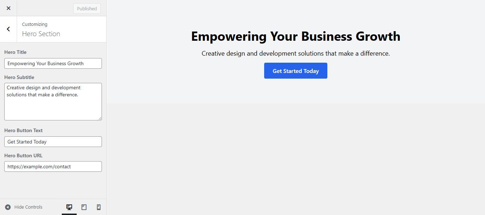
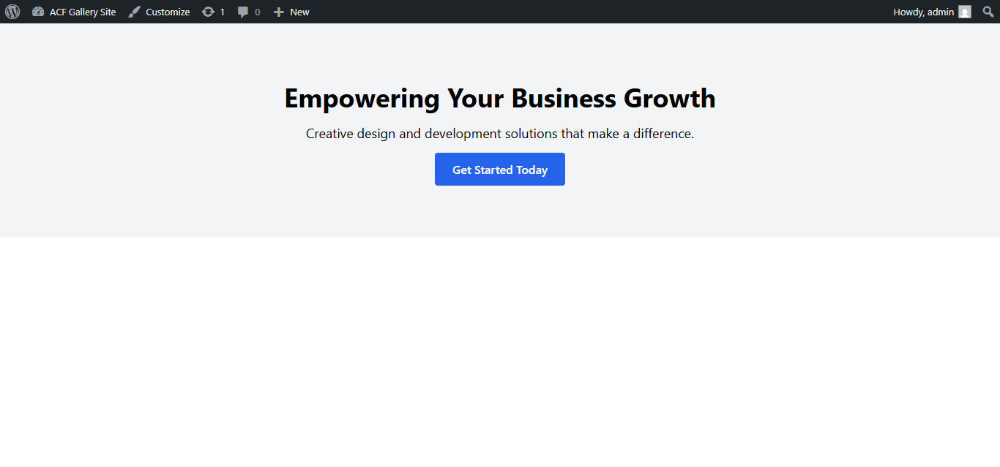
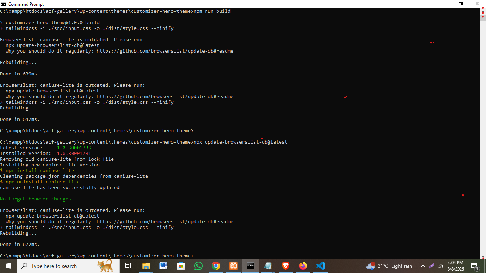
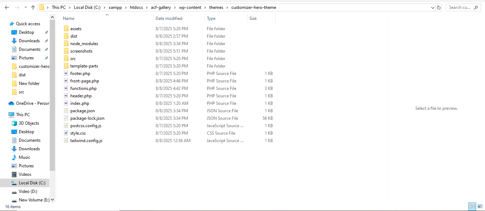

# Customizer Hero Theme

A modern WordPress theme built with **Tailwind CSS** featuring a dynamic Hero Section controlled via the WordPress **Customizer API**.

---

## Key Features

- 🎯 Fully responsive and customizable Hero Section controlled via WordPress Customizer  
- 🖋️ Admin can easily edit Hero Title, Subtitle, Button Text, and Button URL  
- 🔗 Button links can be dynamically set from the Customizer  
- ⚙️ Built with clean PHP and Tailwind CSS for modern UI  
- 🔄 Efficient build process with Tailwind CLI (npm scripts included)  
- 🆓 100% compatible with WordPress default Customizer and free Tailwind setup  
- 🗂️ Prepared for version control and easy deployment via Git

---
customizer-hero-theme/
├── assets/                  # Static assets (images, fonts) – currently empty
├── dist/                    # Compiled Tailwind CSS output
│   └── style.css
├── node_modules/            # NPM dependencies
├── screenshots/             # Project screenshots
│   ├── customizer-hero-settings.png
│   ├── frontend-hero-section.png
│   ├── npm-build-output.png
│   └── theme-folder-structure.png
├── src/                     # Tailwind CSS input files
│   └── input.css
├── footer.php               # Theme footer
├── front-page.php           # Front page template
├── functions.php            # Theme functions and Customizer API setup
├── header.php               # Theme header
├── index.php                # Main template file
├── package.json             # NPM scripts and dependencies
├── package-lock.json        # Locked NPM versions
├── postcss.config.js        # PostCSS config for Tailwind CSS
├── style.css                # Theme main stylesheet (optional)
└── tailwind.config.js       # Tailwind CSS configuration
---

## Installation & Setup

1. Clone or download this repository to your WordPress themes directory:  
   ```
   git clone https://github.com/yourusername/customizer-hero-theme.git
Navigate to the theme folder:

cd customizer-hero-theme
Install npm dependencies:

npm install
Build Tailwind CSS assets:

npm run build
Activate the theme via WordPress Dashboard (Appearance > Themes).

Customizer Usage
Go to Appearance > Customize > Hero Section

Update the following fields:

Hero Title — Main heading of the hero section

Hero Subtitle — Supporting text or tagline

Hero Button Text — Call-to-action button text

Hero Button URL — URL the button links to

Click Publish to save changes

Changes will reflect immediately on the frontend

Development
To watch for CSS changes in real-time, run:

npm run dev
Modify src/input.css for Tailwind custom styles

Extend theme functionality by editing PHP template files

## Screenshots

Below are screenshots demonstrating the theme setup and functionality:

---

### Customizer Hero Section Controls  
This screenshot shows the WordPress Customizer interface where you can modify the Hero Section settings.  


---

### Frontend Hero Section Display  
This screenshot displays the Hero Section as it appears on the frontend of the website.  


---

### Tailwind CSS Build Terminal Output  
This screenshot shows the terminal output after running the Tailwind CSS build command (`npm run build`).  


---

### Theme Folder and File Structure  
An overview of the theme's folder and file organization.  



Portfolio & Contact
This project is related to my Upwork portfolio:
Mahbub’s Upwork Profile (Update the link with your actual profile)

For any questions or support, feel free to contact me.

Developed by Mahbub Shaki

