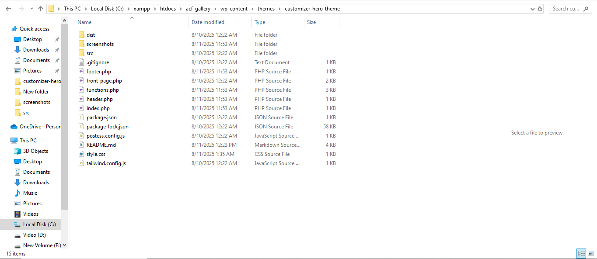

# Customizer Hero Theme

A modern WordPress theme built with **Tailwind CSS** featuring a dynamic Hero Section controlled via the WordPress **Customizer API**.

---

## Key Features

- 🎯 Fully responsive and customizable Hero Section controlled via WordPress Customizer  
- 🖋️ Admin can easily edit Hero Title, Subtitle, Button Text, and Button URL  
- 🔗 Button links can be dynamically set from the Customizer  
- ⚙️ Built with clean PHP and Tailwind CSS for modern UI  
- 🔄 Efficient build process with Tailwind CLI (npm scripts included)  
- 🆓 100% compatible with WordPress default Customizer and free Tailwind setup  
- 🗂️ Prepared for version control and easy deployment via Git

---

## Folder Structure

customizer-hero-theme/
├── dist/
├── screenshots/
├── src/
├── .gitignore
├── footer.php
├── front-page.php
├── functions.php
├── header.php
├── index.php
├── package.json
├── package-lock.json
├── postcss.config.js
├── README.md
├── style.css
└── tailwind.config.js

---

## Installation & Setup

1. Clone or download this repository to your WordPress themes directory:  
   ```
   git clone https://github.com/yourusername/customizer-hero-theme.git
Navigate to the theme folder:

cd customizer-hero-theme
Install npm dependencies:

npm install
Build Tailwind CSS assets:

npm run build
Activate the theme via WordPress Dashboard (Appearance > Themes).

## Customizer Usage

Go to Appearance > Customize > Hero Section

Update the following fields:

Hero Title — Main heading of the hero section

Hero Subtitle — Supporting text or tagline

Hero Button Text — Call-to-action button text

Hero Button URL — URL the button links to

Click Publish to save changes

Changes will reflect immediately on the frontend

## Development
To watch for CSS changes in real-time, run:

npm run dev
Modify src/input.css for Tailwind custom styles

Extend theme functionality by editing PHP template files

## Screenshots

Below are screenshots demonstrating the theme setup and functionality:

---

### Customizer Hero Section Controls  
This screenshot shows the WordPress Customizer interface where you can modify the Hero Section settings.  


---

### Frontend Hero Section Display  
This screenshot displays the Hero Section as it appears on the frontend of the website.  


---

### Tailwind CSS Build Terminal Output  
This screenshot shows the terminal output after running the Tailwind CSS build command (`npm run build`).  


---

### Theme Folder and File Structure  
An overview of the theme's folder and file organization.  



## Portfolio & Contact
This project is related to my Upwork portfolio:
Mahbub’s Upwork Profile ([Update the link with your actual profile](https://www.upwork.com/freelancers/~015df70a23d7f58180?p=1386019951720890368))

For any questions or support, feel free to contact me.

Developed by Mahbub Shaki


